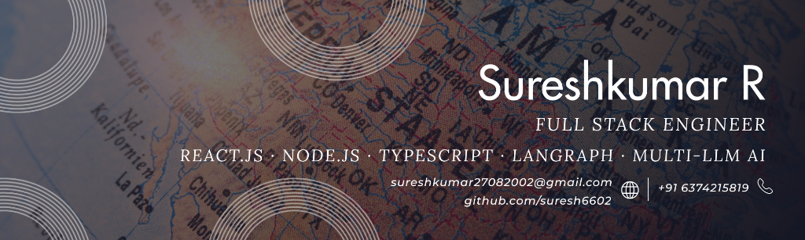

<div align="center">



<br/><br/>

# Sureshkumar R

### Full Stack Engineer · AI Systems & Multi-LLM Agent Developer · PWA Specialist

[](https://drive.google.com/drive/folders/1I4UlRwRDbbzf5ll3eBITZulbyUgnFcSc)
[](https://www.linkedin.com/in/sureshkumar-r-dev)
[](mailto:sureshkumar27082002@gmail.com)
[](https://maps.google.com/?q=Tamil+Nadu,+India)

<br/>

;Multi-LLM+Agent+Workflows+(LangGraph+%7C+Claude+%7C+GPT-4o);React+18+%7C+Next.js+%7C+Node.js+%7C+TypeScript;Built+systems+serving+10%2C000%2B+users+across+2+states;Saved+%244%2C200%2B+in+production+API+spend)

</div>

---

## ⚡ About Me

<table width="100%" border="0">
  <tr>
    <td width="64%" valign="top">
      Full Stack Engineer with <b>3+ years of experience</b> building scalable, high-performance web applications, multi-LLM agent workflows, and offline-first PWAs. Currently developing <b>OneReach (OmniReach AI)</b> at OneData Software Solutions, focusing on multi-channel sales outreach, agentic AI research pipelines, and cloud infrastructure.
      <br/><br/>
      <ul>
        <li>🚀 <b>Proven Track Record</b>: Delivered enterprise & government software adopted across 2 state governments, serving <b>10,000+ active students</b>.</li>
        <li>🤖 <b>AI Systems Engineering</b>: Experience orchestrating stateful multi-agent LLM pipelines (<b>LangGraph, Claude 3.5 Sonnet, GPT-4o, Gemini, AWS Bedrock</b>), vector search (<b>pgvector</b>), and voice AI WebSockets.</li>
        <li>⚙️ <b>Performance & Architecture</b>: Reduced JS bundle sizes by <b>82%</b> (2.5 MB → 450 KB), optimized rendering speed by <b>60%</b>, and saved <b>$4,200+</b> in production API spend.</li>
      </ul>
    </td>
    <td width="36%" align="center" valign="middle">
      
    </td>
  </tr>
</table>

<br/>

### 💡 Engineering Philosophy
- ⚡ **Performance & Scale First**: 82% bundle size reduction (2.5 MB → 450 KB), sub-second TTFB, and offline-first service worker caching for 10,000+ users across low-connectivity regions.
- 🛡️ **API Cost & Resilience**: Designing fail-safe caching layers, rate-limiting, and stateful fallback execution—preventing $4,200+ in production API waste.
- 🎯 **Component Architecture & Standards**: Atomic Design Systems (50+ reusable React/TS components) engineered strictly around WCAG 2.1 AA accessibility guidelines.

---

## 💼 Professional Experience

```
💼 Full Stack Engineer @ OneData Software Solutions                [Jun 2026 – Present]
   └── Core developer on OneReach (OmniReach AI) — Multi-channel sales outreach & AI research platform

💼 Software Engineer (SDE-II) @ NavaDhiti Business Consultancy   [Jul 2023 – Mar 2026]
   └── Scaled 3 concurrent platforms (AXL, Wildway, TELL) for client EkStep Foundation
```

### 🔹 **Full Stack Engineer** | OneData Software Solutions
*Jun 2026 – Present | Coimbatore, India*
* **Multi-Tenant Platform & Backend**: Architected **OneReach (OmniReach AI)** using Node.js (ESM), Express, **Drizzle ORM**, and **PostgreSQL (pgvector)** with `pg-boss` queues, automating LinkedIn, Email, SMS, and WhatsApp messaging.
* **Multi-LLM Agent Workflows**: Orchestrated autonomous prospect discovery & enrichment using **LangGraph**, Claude 3.5 Sonnet, GPT-4o, Gemini, and Apollo API.
* **Voice AI & Cost Engineering**: Built real-time **WebSocket voice AI bridge**, React Native mobile apps, and Chrome extension; saved **$4,200+** in production API spend via intelligent caching.

### 🔹 **Software Engineer (SDE-II)** | NavaDhiti Business Consultancy Pvt. Ltd.
*Jul 2023 – Mar 2026 | Bangalore, India*
* **State-Scale Platforms**: Delivered 3 production PWAs (**AXL**, **Wildway**, **TELL**) for **EkStep Foundation**, adopted by 2 state governments (Karnataka & Telangana) for **10,000+ active students**.
* **Design System & Performance**: Architected a 50+ component React/TypeScript Atomic Design System and engineered an **82% JS bundle reduction** (2.5 MB → 450 KB) via code splitting and CDN asset offloading.
* **Offline-First PWA**: Achieved **60% faster rendering** on low-connectivity networks using Service Workers and progressive caching strategies.
* **Microservices Architecture**: Designed 6 independently deployable GCP microservices (orchestration, content, learner, telemetry) maintaining **ISO 27001 compliance**.

---

## 🛠️ Technical Arsenal

<table align="center">
  <tr>
    <td width="50%" valign="top">
      <h4>💻 Frontend & Mobile</h4>
      
      
      
      
      
      
      
      
    </td>
    <td width="50%" valign="top">
      <h4>⚙️ Backend & Data Architecture</h4>
      
      
      
      
      
      
      
      
    </td>
  </tr>
  <tr>
    <td width="50%" valign="top">
      <h4>🤖 AI Systems & LLM Orchestration</h4>
      
      
      
      
      
      
    </td>
    <td width="50%" valign="top">
      <h4>☁️ DevOps, Cloud & Testing</h4>
      
      
      
      
      
      
    </td>
  </tr>
</table>

---

## 🔥 Featured Projects

### 🚀 **OneReach (OmniReach AI) – Multi-Channel Sales Outreach & AI Research Platform**
> *Multi-channel messaging engine, LangGraph agent research pipeline & Voice AI WebSocket bridge*

```
┌─────────────────────────────────────────────────────────────────────────────────────────┐
│ React 18 / Vite / TS  ──► Node.js ESM Backend (Drizzle + pgvector) ──► Multi-Tenant DB   │
│ React Native / Chrome ──► WebSocket Voice AI Bridge ──► LangGraph Multi-LLM Agents      │
└─────────────────────────────────────────────────────────────────────────────────────────┘
```

* **Multi-Channel Automation**: Unified LinkedIn, Email (Gmail/Outlook), SMS & WhatsApp messaging engine with strict multi-tenant workspace isolation (`pg-boss` queues).
* **Agentic AI & Enrichment**: Stateful **LangGraph** multi-agent pipelines for lead discovery & Apollo API company data enrichment.
* **Real-Time & Cross-Platform**: Low-latency WebSocket Voice AI bridge, Chrome extension for LinkedIn research, and React Native offline lead capture.
* **Cost Engineering & Impact**: Saved **$4,200+ in production API spend** via intelligent query caching & rate limiting.

`React 18` `TypeScript` `Node.js (ESM)` `Express` `Drizzle ORM` `PostgreSQL` `pgvector` `LangGraph` `OpenAI` `Claude 3.5` `AWS Bedrock` `WebSockets` `React Native` `Chrome Extension` `TailwindCSS` `Docker` `Stripe` `Playwright`

---

### 🎓 **AXL & Kalikadeepa Analytics — State-Scale Learning PWA**
> *Offline-first educational PWA & analytics dashboard · EkStep Foundation*

* Built state-level learning PWA and administrative analytics dashboard deployed across **Karnataka & Telangana** serving **10,000+ active students**.
* Deployed across 6 GCP microservices (orchestration, content, telemetry) with 80%+ unit test coverage using Jest/RTL.
* Achieved an **82% JS bundle reduction** (2.5 MB → 450 KB) and reduced administrative manual reporting time by **45%**.

`React.js` `Next.js` `Node.js` `MongoDB` `PWA` `GCP Microservices` `Recharts`

---

### 🐾 **WILDWAY — Real-Time Wildlife Field Tracking PWA**
> *Geospatial field-tracking PWA & automated alert trigger pipeline · EkStep Foundation*

* Developed real-time incident logging platform for wildlife field rangers operating in remote, low-connectivity zones.
* Integrated **Firebase Realtime DB** sync and push notifications, boosting ranger incident response efficiency by **50%**.

`React` `Firebase Realtime DB` `PWA` `Push Notifications` `Gemini API`

---

### 🗣️ **TELL — Indic Language Speech & Evaluation Engine**
> *Multilingual speech recognition & pronunciation feedback platform · EkStep Foundation*

* Integrated **Bharat ASR/TTS** APIs across 10+ Indic languages for spoken pronunciation assessment serving 5,000+ learners.
* Leveraged Indic-language phoneme alignment, outperforming generic ASR systems in spoken reliability and scoring precision.

`React` `Node.js` `Bharat ASR/TTS` `Indic Phonemes` `Adaptive Analytics`

---

## 🔬 Tech Radar & Currently Exploring

- 🤖 **DeepSeek R1 & Local LLMs**: Benchmarking quantized open-weight reasoning models via Ollama & vLLM for zero-cost local agent fallback.
- 🧠 **Advanced RAG & Hybrid Search**: Implementing HNSW indexing & reciprocal rank fusion (RRF) combining BM25 full-text search with `pgvector` embeddings.
- ⚡ **Edge AI & WebGPU**: Experimenting with browser-side AI models (Transformers.js) for instant offline speech & text evaluation.

---

## 📊 Key Engineering Impact

<div align="center">

| 👥 Users Served | 💰 Production API Cost Saved | ⚡ Bundle Size Cut | 🚀 PWA Rendering Speed | 🌐 Indic Languages Supported | 🏛️ State Deployments |
| :---: | :---: | :---: | :---: | :---: | :---: |
| **10,000+** | **$4,200+** | **82% (2.5MB → 450KB)** | **+60% Faster** | **10+ Languages** | **2 States** |

</div>

---

## 📈 GitHub Activity & Statistics

<div align="center">

<br/>

<!-- 3-in-1-Row: GitHub Stats | Streak Stats | Most Used Languages (Matching Image 1) -->
<table align="center" width="100%">
  <tr>
    <td width="34%" align="center" valign="top">
      
    </td>
    <td width="33%" align="center" valign="top">
      
    </td>
    <td width="33%" align="center" valign="top">
      
    </td>
  </tr>
</table>

<br/>
</div>

---

## 📫 Let's Connect & Collaborate

<div align="center">

I am actively open to **Full Stack / SDE-II / AI Engineering roles**, **AI-first product teams**, and **high-impact technical collaborations**.

[](https://drive.google.com/drive/folders/1I4UlRwRDbbzf5ll3eBITZulbyUgnFcSc)
[](https://www.linkedin.com/in/sureshkumar-r-dev)
[](mailto:sureshkumar27082002@gmail.com)

<br/>


</div>
